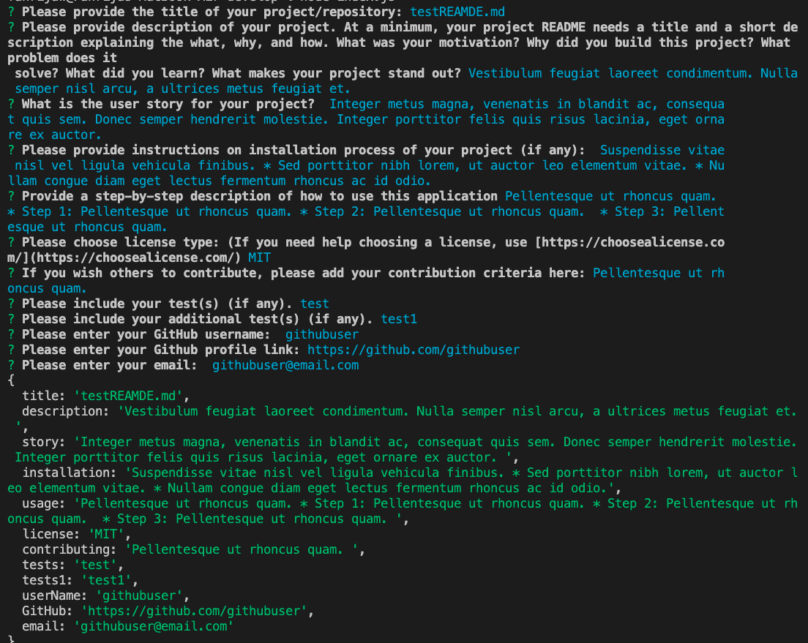

<h1 align='center'>READMEgenerator</h1>

### By likica * [Email me](mailto:codefin9@hotmail.com) * 
  * [Walkthrough-video Link](https://drive.google.com/file/d/1b-E5oGb8CAF71Z-sjC9BJusf5sOTJ9-5/view) 
  

    
    
    
    </a>

  

    
    
    
    
    

## Description 
A command-line application that dynamically generates a professional README.md file from a user's input using the Inquirer package (Links to an external site.)
The README.md file is created in the "dist" folder within "develop" directory and can be found [here](Develop/dist/testREADME.md)

## Table of contents
  * [Description](#Description)
  * [Installation Instructions](#installation-Instructions)
  * [Usage Instructions](#Usage-Instructions)
  * [Questions](#Questions)
  * [Contributing](#Contributing)
  * [Tests](#Tests)
  * [License](#License)
 
  # Description
  ##### [Back to Table of Contents](#Table-of-Contents)
  This application was built in aim to provide a way to quickly and easily create README.md file(s). Coding takes a lot of time, hence the idea for this application. I have learnt using the 'inquirer' for prompting my users for their input by answering listed questions. It is fun and easy to use.

  ## User Story
  ##### [Back to Table of Contents](#Table-of-Contents)
  AS A developer I WANT a README generator * SO THAT I can quickly create a professional README for a new project * GIVEN a command-line application that accepts user input * WHEN I am prompted for information about my application repository * THEN a high-quality, professional README.md is generated with the * title of my project and sections entitled Description, Table of * Contents, Installation, Usage, License, Contributing, Tests, and Questions * WHEN I enter my project title * THEN this is displayed as the title of the README * WHEN I enter a description, installation instructions, usage * information, contribution guidelines, and test instructions * THEN this information is added to the sections of the README * entitled Description, Installation, Usage, Contributing, and Tests * WHEN I choose a license for my application from a list of options * THEN a badge for that license is added near the top of the README * and a notice is added to the section of the README entitled License * that explains which license the application is covered under * WHEN I enter my GitHub username *  THEN this is added to the section of the README entitled Questions, * with a link to my GitHub profile * WHEN I enter my email address * THEN this is added to the section of the README entitled Questions, * with instructions on how to reach me with additional questions * WHEN I click on the links in the Table of Contents * THEN I am taken to the corresponding section of the README

  ## Installation Instructions
  ##### [Back to Table of Contents](#Table-of-Contents)
  * Requirements
      - User needs to have npm package installed and terminal/bash or VSCode available
  * Step 1:
- npm install
* Step 2:
- node run index.js
* Step 3:
- Asnwer question prompts in terminal
Step 4:
- Open your generated testREADME.md file located in dist directory(within Develop directory)

  ## Usage Instructions
  ##### [Back to Table of Contents](#Table-of-Contents)
  This project is used for easy and quick README.md file creating
    * Requirements
- User needs to have npm package installed and terminal/bash or VSCode available
  * Step 1:
    - npm install

    

  - _(You have to be in **Develop folder** when running the app)_
    * Step 2:
      - node run index.js
    

    

  
  * Step 3:
    
      - Answer question prompts in terminal. 
      - Once you answer all questions, your README file will be generated.
    

    
    
    

 
  * Step 4:
    - Open your generated testREADME.md file located in dist directory(within Develop directory).
    - You can edit this file by removing/adding sections and/or images or other links.
    

    

  ## Contributing
  ##### [Back to Table of Contents](#Table-of-Contents)
  Others are welcome to contribute, respecting the license which this project is listed under

  ## Tests
  #### [Back to Table of Contents](#Table-of-Contents)
  1. testREADME.md
  2. testREADME-1.md

  ## Questions
  ##### [Back to Table of Contents](#Table-of-Contents)
  * If you have any questions, please [Email me](mailto:codefin9@hotmail.com)

  ## License 
  ##### [Back to Table of Contents](#Table-of-Contents)
  * License Type: MIT
    
    [License: MIT](https://opensource.org/licenses/MIT)
    Permission is hereby granted, free of charge, to any person obtaining a copy of this software and associated documentation files (the "Software"), to deal in the Software without restriction, including without limitation the rights to use, copy, modify, merge, publish, distribute, sublicense, and/or sell copies of the Software, and to permit persons to whom the Software is furnished to do so, subject to the following conditions:The above copyright notice and this permission notice shall be included in all copies or substantial portions of the Software.THE SOFTWARE IS PROVIDED "AS IS", WITHOUT WARRANTY OF ANY KIND, EXPRESS OR IMPLIED, INCLUDING BUT NOT LIMITED TO THE WARRANTIES OF MERCHANTABILITY, FITNESS FOR A PARTICULAR PURPOSE AND NONINFRINGEMENT. IN NO EVENT SHALL THE AUTHORS OR COPYRIGHT HOLDERS BE LIABLE FOR ANY CLAIM, DAMAGES OR OTHER LIABILITY, WHETHER IN AN ACTION OF CONTRACT, TORT OR OTHERWISE, ARISING FROM, OUT OF OR IN CONNECTION WITH THE SOFTWARE OR THE USE OR OTHER DEALINGS IN THE SOFTWARE.

  _This README was generated by Likica with_ ❤️ [GitHub Profile](https://github.com/likica)
